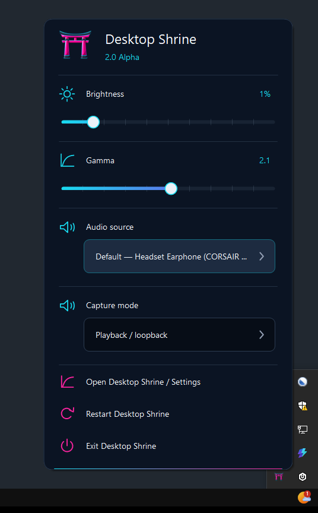
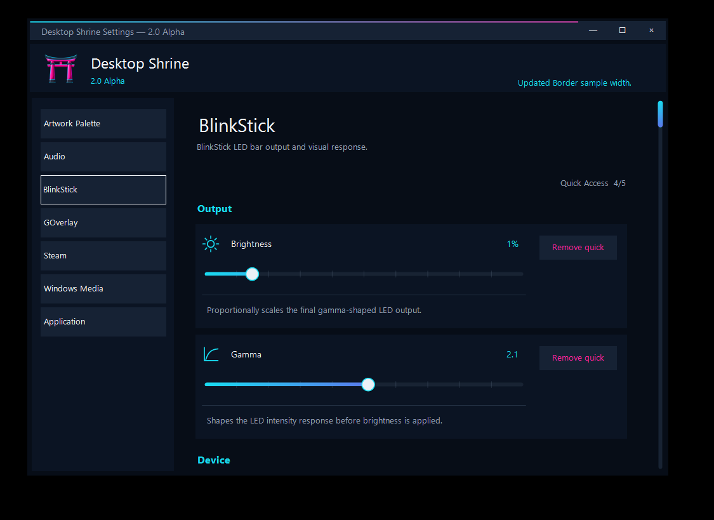
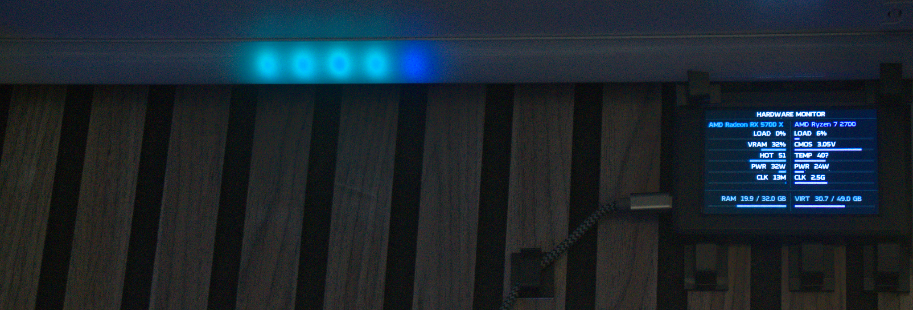
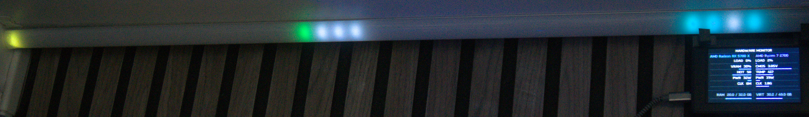

# Desktop Shrine

Desktop Shrine is a modular Windows desktop runtime that turns activity on the computer into ambient visual output.

It can react to music, games, desktop audio, and hardware activity, then present that information through devices such as a GOverlay LCD screen or a BlinkStick RGBW LED strip. Inputs and outputs are implemented as plugins, allowing the system to grow without turning the host application into one enormous switch statement.

Release history since the last public `1.1.0` build is recorded in [`CHANGELOG.md`](CHANGELOG.md).

> [!NOTE]
> Desktop Shrine is a personal project, so some setup or hardware-specific configuration may be required.

## Screenshots

### Quick Access

The notification-area Quick Access panel exposes selected live controls without opening the full settings window.

<p align="center">
  
</p>

### Settings

Double-left-clicking the notification-area icon opens the full settings window. Plugin settings remain grouped by their owning plugin, while live-safe values can be changed immediately without restarting Desktop Shrine.

<p align="center">
  
</p>

### Hardware telemetry

Desktop Shrine can turn CPU and GPU telemetry into a live physical display. The RGBW bar reacts independently to hardware activity while the GOverlay screen presents the underlying system statistics.

<p align="center">
  
</p>

<details>
<summary>Wide hardware view</summary>

<p align="center">
  
</p>

</details>

## Demo videos

Short demo clips can live under `videos/`. H.264 MP4 is recommended for broad GitHub and browser compatibility.

<!--
Add the recorded clips to the repository and uncomment the relevant links.

### Media visualiser

[Watch the media and audio visualiser demo](videos/MediaVisualiser.mp4)

### Hardware telemetry

[Watch the hardware telemetry demo](videos/HardwareTelemetry.mp4)

### Routing and state changes

[Watch the automatic routing demo](videos/RoutingDemo.mp4)
-->

## Current features

### Inputs

- **Windows Now Playing** reads media information exposed through Windows media controls.
- **Steam Now Playing** detects the currently running Steam game and can load local artwork and optional store metadata.
- **Audio Collector** captures desktop audio or an input device and produces spectrum data for visualisers.
- **Hardware Monitor** uses LibreHardwareMonitor to provide CPU, GPU, temperature, power, fan, clock, and memory telemetry when supported by the system.

### Intermediaries

- **Artwork Palette** extracts a small colour palette from album or game artwork for use by visual outputs.

### Outputs

- **GOverlay LCDSysInfo** displays media, game, and hardware information on a supported GOverlay screen.
- **BlinkStick RGBW** provides audio-reactive and hardware-reactive LED effects.
- **Taskbar Controls** provides the notification-area Quick Access panel and full Desktop Shrine settings window.
- **Console Display** exposes plugin activity and state during development.

## How routing works

Each output has its own ordered list of enabled inputs. The highest-priority active input is selected independently for that output.

For example, the LED strip can use the audio spectrum and artwork palette while media is playing, then fall back to a hardware activity display when the media input becomes inactive. A separate idle-animation plugin can sit at the bottom of the priority list.

Routing profiles are stored in:

```text
configuration/output-input-profiles.json
```

Changes are validated and published to running outputs without requiring the entire host to restart.

## Running the project

Desktop Shrine targets **.NET 10** and is currently intended primarily for Windows.

Build and test the solution with:

```bash
dotnet test DesktopShrine.slnx
```

For local development, run the `DesktopShrine.Host` project. Debug builds automatically stage the bundled contracts and plugins beside the host.

Once running, start media through a Windows-compatible player or launch a Steam game. The console output can be used to verify discovered plugins, published state, audio data, artwork palettes, and output routing.

## Windows installer

Run `build-installer.cmd` to test and publish a self-contained Release build and compile the Windows installer.

Release packages:

- run silently in the signed-in desktop session
- exclude the development Console Display plugin
- do not require users to install the .NET 10 runtime separately

Setup offers startup with Windows and administrator mode, which is recommended for complete hardware telemetry. It can also download and launch the official legacy GOverlay 1.6.9 installer and install the Desktop Shrine bridge.

See [`docs/installation.md`](docs/installation.md) for the complete dependency and build requirements.

### GOverlay setup

After installing GOverlay and the Desktop Shrine bridge:

1. Open GOverlay and enable the Desktop Shrine plugin.
2. Create a new GOverlay profile for Desktop Shrine.
3. Add the Desktop Shrine plugin to the new profile.
4. Upload the bundled `Oxanium-Bold_20px.bin` font to GOverlay.
5. Select the new profile and start Desktop Shrine.

The GOverlay output should then be available to display media, game, and hardware information published by Desktop Shrine.

`DontUseDrawPixels` in `configuration/plugins/goverlay.json` defaults to `true`. In that mode, album artwork is prepared as a bounded adaptive set of filled rectangles while all other drawing uses the normal renderer.

Set it to `false` for a device known to support the original `LCDSys2_Draw_Pixels` artwork transfer.

## Configuration

Each plugin has a flat JSON configuration file:

```text
configuration/plugins/<plugin-id>.json
```

When a plugin is discovered without a matching file, the host creates an empty configuration file so its settings have an obvious home.

Configuration values can also be overridden through normal .NET configuration sources. For example:

```text
Plugins__audio-collector__FramesPerSecond=30
```

This overrides:

```text
Plugins:audio-collector:FramesPerSecond
```

### Desktop settings

Double-left-click the Desktop Shrine notification-area icon to open the full settings window.

Installed plugins contribute lightweight `settings.json` metadata while values continue to read from and write to their existing per-plugin configuration files. Live-safe changes are applied immediately. Startup-bound settings are marked with `*` and explain why a restart is required.

The settings catalogue, configuration editing service, and tray model remain independent of the BlinkStick renderer, so the UI does not require a particular input or output plugin to be installed.

### Quick Access

Right-click the notification-area icon to open the compact Desktop Shrine-themed Quick Access panel.

Up to five suitable sliders, toggles, or selectors can be selected from the full settings window and pinned to Quick Access. BlinkStick brightness, BlinkStick gamma, and Audio source are selected by default for existing behaviour.

Stable setting IDs are stored in:

```text
configuration/plugins/taskbar-controls.json
```

Missing or removed plugin settings are ignored safely.

The same menu also provides:

- **Open Desktop Shrine / Settings**
- **Restart Desktop Shrine**
- **Exit Desktop Shrine**

Restart and exit use the normal host shutdown sequence so producers stop, outputs clear, and plugins dispose before termination. Restart launches the replacement process only after that shared cleanup completes.

### Audio capture

The Audio Collector captures the default Windows desktop output at 50 frames per second by default.

Audio device changes rebind the running capture plugin without restarting Desktop Shrine. Active endpoints are saved by their stable Windows device ID. If a saved endpoint disappears, capture temporarily follows the default device and returns to the saved endpoint if it becomes available again.

To configure capture manually, edit:

```text
configuration/plugins/audio-collector.json
```

### Steam integration

The Steam input reads the running AppID, discovers installed Steam libraries, and resolves the matching application manifest.

Optional artwork and Steam store metadata can be enabled in:

```text
configuration/plugins/steam-now-playing.json
```

Artwork is resolved from local Steam files where possible and can optionally fall back to downloaded or executable artwork. Cached data is stored beneath the current user's local application data directory unless another cache location is configured.

## BlinkStick visualiser

While media is active, each audio frequency band is mapped through colours extracted from the current artwork. Low-energy bands use the darker palette colours, while stronger peaks lerp toward the brighter colours.

When hardware monitoring is selected, the strip is divided at its centre:

- GPU activity moves outward across one half.
- CPU activity moves outward across the other.
- Workload affects brightness and movement.
- Power draw affects trail length.
- Temperature shifts the effect from cool tones toward warning colours.

The development defaults target 48 RGBW pixels on BlinkStick Pro channel 0, render at 20 frames per second, and enforce a conservative USB power budget. Separately powered strips can be configured explicitly.

Both media/Steam audio and hardware telemetry emit unscaled RGBW effect frames into one shared output stage. That stage applies user gamma, proportionally scales the gamma-shaped result by user brightness, then applies the USB/electrical limit and final device quantisation.

It does not derive correction multipliers from frame luminance.

`HardwareGamma` remains an effect-shaping control for telemetry waves. It is separate from the user output gamma and is applied during telemetry effect generation.

BlinkStick settings are stored in:

```text
configuration/plugins/blinkstick-bar.json
```

The host watches this file and applies valid BlinkStick setting changes while it is running. Invalid snapshots are rejected and the last valid settings stay active.

Brightness selects exact 1% values from 0% through 100%, while logarithmic slider travel gives lower values more room. Gamma uses linear 0.1 steps from 0.1 through 4.0. Saved values remain ordinary linear numbers in the plugin JSON and persist across launches.

## Plugin layout

The host discovers:

- passive contract assemblies from `contracts`
- active plugin assemblies from `plugins`

Sample deployment manifests live alongside the sample projects.

The architecture follows a ports-and-adapters approach: plugins communicate through shared contracts, while device-specific or platform-specific code remains at the edges of the system.

## Licence

Desktop Shrine is licensed under the [MIT License](LICENSE).

Third-party components and assets retain their respective licences; see [`THIRD-PARTY-NOTICES.md`](THIRD-PARTY-NOTICES.md) for details.
